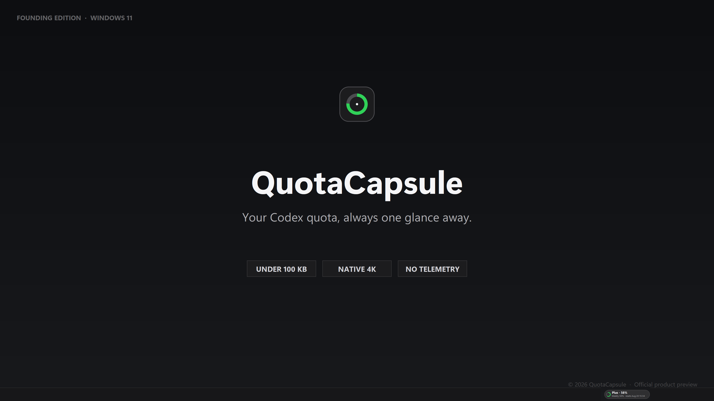
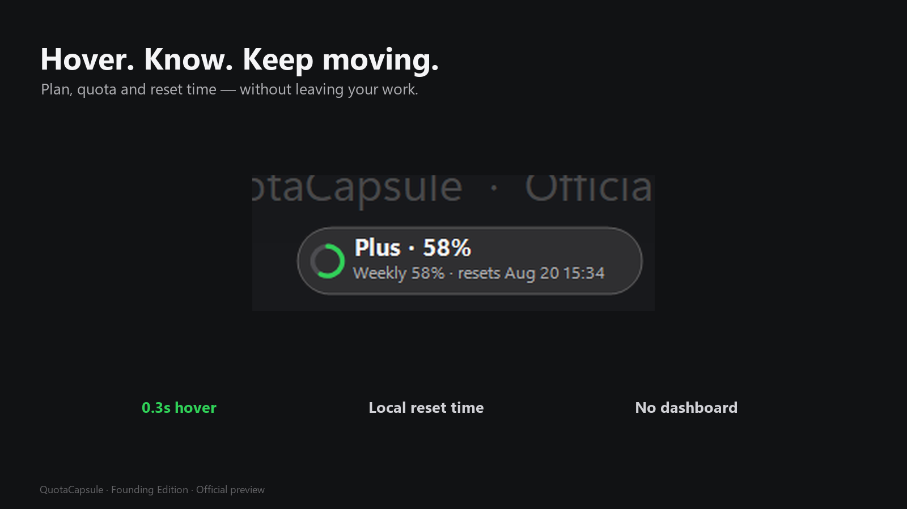
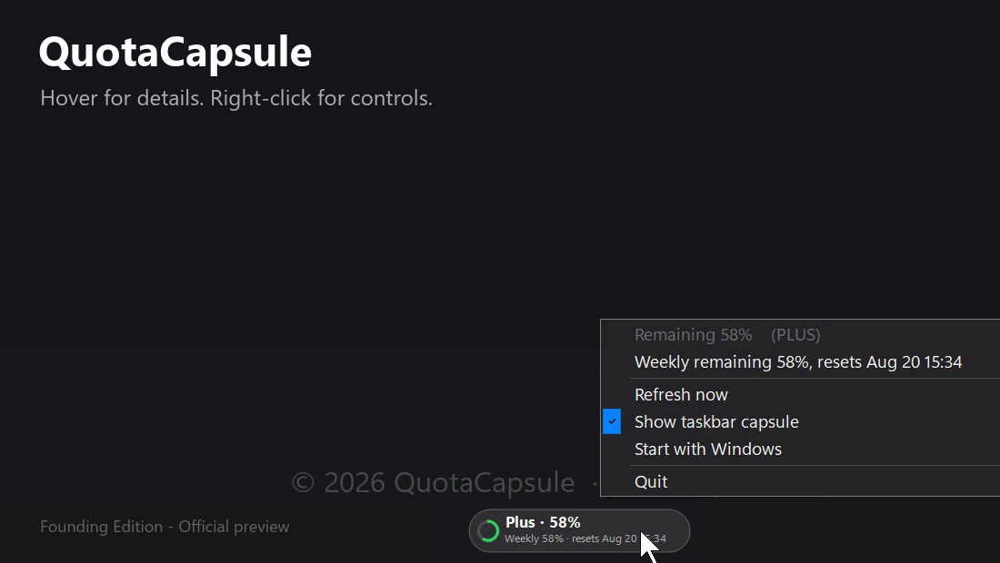

# QuotaCapsule

**Your Codex quota, always one glance away in the Windows 11 taskbar.**

[Get QuotaCapsule — Founding Edition for $1](https://colin-12.itch.io/quota-capsule)

QuotaCapsule is a tiny native Windows utility that keeps your remaining Codex usage visible beside the notification area. Hover for 0.3 seconds to see your plan, quota windows, and local reset time. Move away and the capsule becomes compact again.

## Why it exists

Checking a dashboard breaks focus. QuotaCapsule keeps the answer where you are already looking: the taskbar.

- Under 100 KB on disk
- Native Per-Monitor V2 rendering for crisp 4K displays
- No Electron, WebView, installer, service, or administrator rights
- No ads, telemetry, analytics, account system, logs, or developer server
- Automatic taskbar positioning, including TrafficMonitor-aware placement
- 0.3-second hover details and a compact right-click control menu

## Requirements

- Windows 11
- A locally signed-in Codex installation using your ChatGPT account

QuotaCapsule displays Codex/agentic usage. It does not report general ChatGPT messages, image-generation limits, Deep Research usage, or OpenAI API billing.

## Privacy

QuotaCapsule reads the existing Codex authentication file in memory and requests usage information directly from `https://chatgpt.com/backend-api/wham/usage`.

It does not store passwords or tokens, write logs, include telemetry, or send data to a QuotaCapsule server.

## Founding Edition

The first 50 licenses are available for **$1 one time**, including personal use on up to three Windows devices and version 1.x updates.

[View the product page and purchase](https://colin-12.itch.io/quota-capsule)

## Important notice

This repository is a product-information page only. It does not contain the paid executable or its source code. Please use the official itch.io page for downloads and SHA-256 verification.

QuotaCapsule is independent and unofficial. It is not affiliated with, endorsed by, sponsored by, or certified by OpenAI. OpenAI, ChatGPT, and Codex are trademarks of their respective owner.

